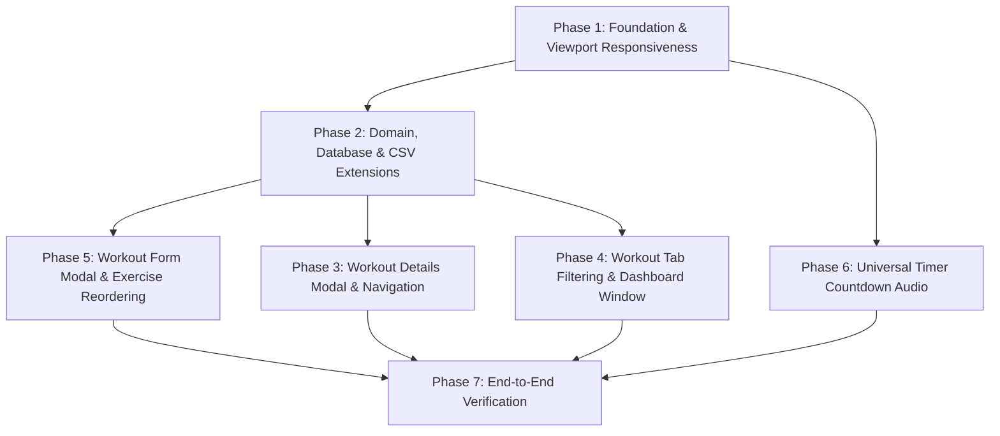

# Plan: Workout Management, UX & Mobile Responsiveness Improvements

## Overview & Objectives
This plan addresses architectural, UX, and functional issues identified in the workout lifecycle, mobile responsiveness, navigation, timer feedback, and CSV import logic.

---

## 1. Issues & Requirements Breakdown

| # | Identified Issue | Proposed Solution |
|---|------------------|-------------------|
| **1** | **Mobile web viewport & responsiveness**: Mobile browsers require "See as computer page" because of missing viewport meta tags and fixed/cramped multi-column layouts. | Add Expo Router `+html.tsx` with standard mobile viewport meta tag + CSS resets; refactor screen layouts into fluid, stacked, responsive layouts. |
| **2** | **Workout Tab lacking filters and sorting**: All workouts are shown in an unsorted/static list with no weekday or type filtering. | Add day filter chips (Hoje, Segunda..Domingo, Sem agendamento), workout type filter (Calistenia, Musculação, HIT), and sorting options (Horário, Nome, Quantidade de Exercícios). |
| **3** | **Dashboard "Next Workout" timing**: Flips immediately at the scheduled minute to the next session (often days away). | Introduce a 1-hour lead-time window and a 60-minute post-schedule grace period in `GetNextWorkout`. |
| **4** | **Workout discovery & inspection UX**: Clicking workouts in Plan does nothing; clicking in Workout tab immediately starts the session without viewing exercise details. | Introduce a reusable `WorkoutDetailModal` (or dedicated detail view) displaying full exercise specifications with explicit "Iniciar Treino" (Start) and "Editar" (Edit) action buttons. |
| **5** | **Exercise reordering**: No way to change the sequence of exercises in a workout. | Add explicit `orderIndex` to exercises and drag-and-drop / move-up/down controls in the workout editor. |
| **6** | **Heavy text buttons**: Action buttons use long Portuguese strings ("Editar", "Excluir", "+ Exercício") taking up valuable mobile screen space. | Replace with standardized `@expo/vector-icons` (Ionicons) for edit, delete, add, start, and reorder actions. |
| **7** | **Workout form positioning & scroll disorientation**: Editing a workout injects a form at the top of the scroll list without auto-scrolling. | Move workout creation/editing to a dedicated Modal Dialog (`WorkoutFormModal`) with its own scroll container, header, and fixed action buttons. |
| **8** | **Timer countdown audio**: No audio cues during the final countdown seconds across timers. | Implement universal countdown audio (Web Audio API synthesis on web, sound synthesis / audio on native) playing short beeps on 5, 4, 3, 2, 1s and a finish chime at 0s. |
| **9** | **Interval & exercise model overhaul**: Exercises lack distinct configuration for rest between series vs. rest before moving to the next exercise, and CSV import does not parse these intervals. | Extend `Exercise` model and DB schema with nullable `weightKg`, `durationSeconds`, `restSecondsBetweenSets`, and `restSecondsBeforeNextExercise`; upgrade CSV parser to detect intervals. |

---

## 2. Prioritized Implementation Roadmap



---

### **Phase 1: Mobile Web Viewport & Responsiveness Foundation (Priority 1)**
*Goal: Ensure the web app renders correctly on mobile browsers at native scale without desktop emulation.*

1. **Web HTML Viewport (`app/+html.tsx`)**:
   - Create the Expo Router root HTML template.
   - Configure viewport meta tag:
     ```html
     <meta name="viewport" content="width=device-width, initial-scale=1, shrink-to-fit=no, maximum-scale=1, viewport-fit=cover" />
     ```
   - Add base CSS reset ensuring full viewport height and preventing horizontal overflow:
     ```css
     html, body, #root {
       width: 100%;
       min-height: 100%;
       overflow-x: hidden;
       background-color: #0A0A0F;
     }
     ```
2. **Screen Layout Audit & Mobile-First Styling**:
   - `app/(tabs)/workout.tsx`: Replace 4-column inline inputs with stacked responsive cards.
   - `app/(tabs)/plan.tsx`: Optimize filter chip scrolling and card text wrapping for 360px–412px mobile screens.
   - `app/(tabs)/nutrition.tsx` & `app/(tabs)/index.tsx`: Ensure cards, macro rows, and buttons never cause horizontal scrolling.
   - `app/workout/active.tsx`: Ensure timer circle and set controls scale appropriately on small screen heights.

---

### **Phase 2: Domain, Database & CSV Extensions for Intervals & Ordering (Priority 2)**
*Goal: Support granular intervals (between sets vs before next exercise), duration, weight, and exercise sequence.*

1. **Domain Model (`src/domain/entities/Workout.ts`)**:
   - Extend the `Exercise` interface:
     ```typescript
     export interface Exercise {
       id: string;
       name: string;
       orderIndex: number;
       sets: number | null;
       repsPerSet: number | null;
       weightKg: number | null;
       durationSeconds: number | null;
       restSecondsBetweenSets: number | null; // e.g. 15s between series
       restSecondsBeforeNextExercise: number | null; // e.g. 30s before next exercise
       notes: string | null;
     }
     ```
   - Update `createExercise` factory function with default `orderIndex` and nullable properties.
2. **Database Schema & Migrations**:
   - Create Supabase migration `src/infrastructure/supabase/migrations/006_exercise_intervals_and_order.sql`:
     ```sql
     alter table if exists exercises
       add column if not exists order_index integer default 0,
       add column if not exists rest_seconds_between_sets integer,
       add column if not exists rest_seconds_before_next_exercise integer;
     ```
3. **Repository Implementations**:
   - `src/adapters/supabase/SupabaseWorkoutRepository.ts`:
     - Order exercise queries by `order_index asc`.
     - Map and persist `order_index`, `rest_seconds_between_sets`, and `rest_seconds_before_next_exercise`.
   - `src/adapters/local/LocalWorkoutRepository.ts`:
     - Ensure local storage serialization and deserialization retains the new fields and orders by `orderIndex`.
4. **CSV Workout Parser (`src/domain/use-cases/workout/ParseCsvWorkouts.ts`)**:
   - Extend parser to extract rest intervals from prescription strings and notes (e.g., `4x 10 Flexões (descanso: 15s / 30s transição)` or `3x 45s Prancha + 15s rest`).
   - Assign sequential `orderIndex` based on parsed exercise order.
5. **Active Workout Execution Engine (`app/workout/active.tsx`)**:
   - Update set completion logic:
     - When finishing set $k < N$: start rest timer with `currentExercise.restSecondsBetweenSets ?? DEFAULT_REST_DURATION`.
     - When finishing final set $N$ of exercise $E$: start rest timer with `currentExercise.restSecondsBeforeNextExercise ?? currentExercise.restSecondsBetweenSets ?? DEFAULT_REST_DURATION`.

---

### **Phase 3: Workout Details Modal & Universal Click-to-Inspect (Priority 3)**
*Goal: Prevent unintended workout starts; allow inspecting exercises, sets, reps, weight, and intervals from any screen before starting.*

1. **`WorkoutDetailModal` Component (`src/ui/components/WorkoutDetailModal.tsx`)**:
   - Modal overlay displaying:
     - Header: Workout name, type badge (HIT/Calisthenics/Weightlifting), scheduled time/weekday, and close button.
     - Summary Stats: Total exercises, estimated duration, total sets.
     - Exercise List:
       - Exercise name and order badge.
       - Prescription badge: e.g., `4 séries × 10 reps` or `3 séries × 45s`.
       - Weight badge: e.g., `4.5 kg` (if specified).
       - Interval tags: `Descanso: 15s` (entre séries) and `Transição: 30s` (próximo exercício).
       - Notes / alternative exercises.
     - Footer:
       - Secondary "Editar" button (pencil icon) to open the workout edit modal.
       - Primary "Iniciar Treino" button (play icon) navigating to `app/workout/active.tsx?id=...`.
2. **Cross-Tab Integration**:
   - `app/(tabs)/plan.tsx`: Clicking on any workout card in the timeline opens `WorkoutDetailModal`.
   - `app/(tabs)/workout.tsx`: Clicking on a workout card opens `WorkoutDetailModal` instead of directly launching `active.tsx`.
   - `app/(tabs)/index.tsx`: Clicking on the "Próximo Treino" card opens `WorkoutDetailModal`.

---

### **Phase 4: Workout Tab Filtering, Sorting & Dashboard Lead-Time Window (Priority 4)**
*Goal: Provide workout organization on the Workout tab and intelligent dashboard display.*

1. **Workout Tab Filters & Sorters (`app/(tabs)/workout.tsx`)**:
   - **Day Filter Chips**: `Hoje`, `Segunda`, `Terça`, `Quarta`, `Quinta`, `Sexta`, `Sábado`, `Domingo`, `Sem agendamento`, `Todos`.
   - **Type Filter Chips**: `Todos`, `Calistenia`, `HIT`, `Musculação`.
   - **Sort Options**: `Horário agendado (padrão)`, `Nome (A-Z)`, `Quantidade de exercícios`.
2. **Dashboard "Next Workout" Time Window (`src/domain/use-cases/workout/GetNextWorkout.ts` & `app/(tabs)/index.tsx`)**:
   - Update `getNextWorkout` logic:
     - **1-hour lead-time threshold**: A workout is considered "upcoming" if `now <= scheduledAt <= now + 60 minutes`.
     - **60-minute grace period**: If a workout was scheduled within the last 60 minutes (`now - 60 minutes <= scheduledAt <= now`), keep it active on the dashboard so it does not disappear while the user is preparing.
     - **Fallback display**: If no workout is scheduled within the window, show "Nenhum treino na próxima hora" with a subtle indicator of the next scheduled day/time.

---

### **Phase 5: Workout Creation/Editing Modal, Reordering & Icon System (Priority 5)**
*Goal: Replace cramped top-panel form with a clean modal dialog, icon buttons, and exercise reordering.*

1. **`WorkoutFormModal` Component (`src/ui/components/WorkoutFormModal.tsx`)**:
   - Full-screen or large dialog modal with separate scroll context.
   - Header with title ("Novo Treino" / "Editar Treino") and Close button.
   - General info section: Name input, Type selector buttons, Date/Time picker or text input.
2. **Structured Exercise Cards & Inputs**:
   - Each exercise rendered in an isolated card:
     - Header: Exercise # numbering, Move Up/Down buttons, Delete icon button.
     - Inputs:
       - Line 1: Name (`TextInput`).
       - Line 2: Sets, Reps (or Duration toggle/input), Weight in kg (`numeric/decimal`).
       - Line 3: Rest between series (seconds), Rest before next exercise (seconds).
       - Line 4: Notes / observations.
   - Button "+ Adicionar Exercício" with auto-scroll to the newly added row.
3. **Exercise Reordering**:
   - Support reorder via up/down controls (`chevron-up` / `chevron-down` icons) and drag handles (`reorder-two` icon).
   - Recalculates `orderIndex` for all items in the list before saving.
4. **Icon Button System**:
   - Replace long text labels across workout screens with `@expo/vector-icons` Ionicons:
     - Edit: `pencil-outline`
     - Delete: `trash-outline`
     - Add: `add-outline`
     - Start: `play` / `play-outline`
     - Reorder: `chevron-up`, `chevron-down`, `reorder-two`
     - Close: `close-outline`
   - Include accessible tooltips/labels for screen readers.

---

### **Phase 6: Universal Timer Countdown Audio (Priority 6)**
*Goal: Provide acoustic feedback in the final 5 seconds and at completion for all timers.*

1. **Audio Synthesis Utility (`src/ui/utils/sound.ts`)**:
   - Use Web Audio API `AudioContext` on web and synthesized oscillator / `expo-av` playback on native:
     - Countdown tick: 880Hz short pip (100ms) on seconds 5, 4, 3, 2, 1.
     - Completion chime: 1320Hz longer tone (400ms) on second 0.
   - Pure in-memory synthesis: zero audio asset downloads, zero network latency, zero broken asset URLs.
2. **Integration with Timers**:
   - Update `src/ui/hooks/useWorkoutTimer.ts` and `src/ui/components/WorkoutTimer.tsx`.
   - Triggers for all timers:
     - Working-set duration countdowns (e.g. 45s wall-sit).
     - Rest timer between series (e.g. 15s).
     - Rest timer before next exercise (e.g. 30s).

---

## 3. Key Files & Architecture Mapping

| Layer | Files |
|-------|-------|
| **HTML / Root** | `app/+html.tsx`, `app/_layout.tsx` |
| **Domain Entities** | `src/domain/entities/Workout.ts`, `src/domain/entities/WorkoutSession.ts` |
| **Domain Use Cases** | `src/domain/use-cases/workout/ParseCsvWorkouts.ts`, `src/domain/use-cases/workout/GetNextWorkout.ts` |
| **Ports & Repositories** | `src/domain/ports/WorkoutRepository.ts`, `src/adapters/supabase/SupabaseWorkoutRepository.ts`, `src/adapters/local/LocalWorkoutRepository.ts` |
| **Migrations** | `src/infrastructure/supabase/migrations/006_exercise_intervals_and_order.sql` |
| **UI Components** | `src/ui/components/WorkoutDetailModal.tsx`, `src/ui/components/WorkoutFormModal.tsx`, `src/ui/components/WorkoutTimer.tsx`, `src/ui/components/Button.tsx` |
| **UI Hooks & Utilities** | `src/ui/hooks/useWorkoutTimer.ts`, `src/ui/utils/sound.ts` |
| **App Screens** | `app/(tabs)/workout.tsx`, `app/(tabs)/plan.tsx`, `app/(tabs)/index.tsx`, `app/workout/active.tsx` |

---

## 4. Verification & Testing Strategy

1. **Domain Unit Tests (`npx jest --config jest.domain.config.js --no-coverage`)**:
   - `ParseCsvWorkouts.test.ts`: Verify parsing of rest between series, transition rest, and exercise order.
   - `GetNextWorkout.test.ts`: Verify 1-hour lead window and 60-minute post-schedule grace period.
   - `Workout.test.ts`: Verify exercise factory with nullable interval and weight fields.
2. **Repository Unit Tests**:
   - Verify `SupabaseWorkoutRepository` and `LocalWorkoutRepository` insert, update, and fetch exercises ordered by `orderIndex` with all interval fields preserved.
3. **Responsive UI Testing**:
   - Test viewport scaling across 360px, 390px, 412px, 768px, and desktop widths without horizontal scroll or "See as computer page" zoom.
4. **UX & Flow Testing**:
   - Tap workouts in Plan, Workout, and Dashboard → verify `WorkoutDetailModal` opens with full breakdown.
   - Start workout from modal → verify `active.tsx` loads and applies correct rest timers.
   - Reorder exercises in `WorkoutFormModal` → verify saved order persists.
   - Test countdown beeps on seconds 5, 4, 3, 2, 1 and completion chime on web and mobile.
